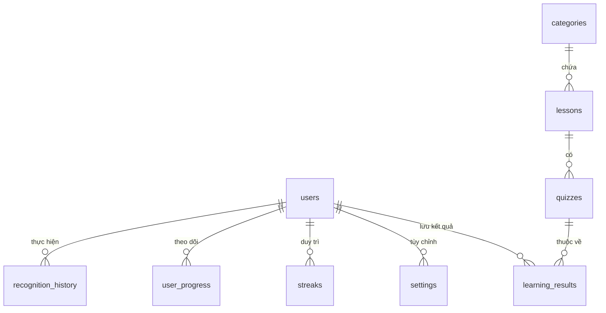

# Tài liệu Thiết kế Cơ sở dữ liệu - Hệ thống Lumina Sign

Hệ thống sử dụng cơ sở dữ liệu quan hệ (RDBMS) để quản lý thông tin người dùng, nội dung học tập và lịch sử nhận diện ngôn ngữ ký hiệu.

## 1. Sơ đồ Quan hệ (ERD Diagram)

## 2. Chi tiết các bảng dữ liệu

### 2.1. Bảng `users` (Quản lý người dùng)
| Trường | Kiểu dữ liệu | Mô tả |
| :--- | :--- | :--- |
| `user_id` | INT (PK) | ID định danh duy nhất, tự động tăng. |
| `name` | VARCHAR(100) | Họ và tên người dùng. |
| `email` | VARCHAR(150) | Email đăng nhập (Unique). |
| `password` | VARCHAR(255) | Mật khẩu đã được mã hóa Hash. |
| `avatar` | VARCHAR(255) | Đường dẫn đến tệp ảnh đại diện. |
| `created_at` | TIMESTAMP | Thời điểm đăng ký tài khoản. |

### 2.2. Bảng `categories` (Danh mục bài học)
| Trường | Kiểu dữ liệu | Mô tả |
| :--- | :--- | :--- |
| `category_id` | INT (PK) | ID danh mục. |
| `category_name` | VARCHAR(100) | Tên danh mục (ví dụ: Chào hỏi, Số đếm). |

### 2.3. Bảng `lessons` (Bài học)
| Trường | Kiểu dữ liệu | Mô tả |
| :--- | :--- | :--- |
| `lesson_id` | INT (PK) | ID bài học. |
| `title` | VARCHAR(100) | Tiêu đề bài học. |
| `category_id` | INT (FK) | Liên kết với bảng categories. |
| `video_url` | VARCHAR(255) | Đường dẫn video hướng dẫn ký hiệu. |
| `thumbnail` | VARCHAR(255) | Ảnh xem trước của bài học. |

### 2.4. Bảng `quizzes` (Câu hỏi kiểm tra)
| Trường | Kiểu dữ liệu | Mô tả |
| :--- | :--- | :--- |
| `quiz_id` | INT (PK) | ID câu hỏi. |
| `lesson_id` | INT (FK) | Liên kết với bài học tương ứng. |
| `question` | TEXT | Nội dung câu hỏi trắc nghiệm. |
| `correct_answer`| VARCHAR(100) | Đáp án chính xác. |

### 2.5. Bảng `recognition_history` (Lịch sử AI)
| Trường | Kiểu dữ liệu | Mô tả |
| :--- | :--- | :--- |
| `history_id` | INT (PK) | ID bản ghi. |
| `user_id` | INT (FK) | Người dùng thực hiện nhận diện. |
| `recognized_text`| VARCHAR(255) | Kết quả văn bản mà AI đã dịch được. |
| `confidence` | FLOAT | Độ tin cậy của kết quả nhận diện. |
| `created_at` | TIMESTAMP | Thời gian thực hiện. |

### 2.6. Bảng `streaks` (Chuỗi ngày học)
| Trường | Kiểu dữ liệu | Mô tả |
| :--- | :--- | :--- |
| `current_streak` | INT | Số ngày học liên tiếp hiện tại. |
| `last_active_date`| DATE | Ngày hoạt động gần nhất. |

### 2.7. Bảng `user_progress` (Tiến độ)
| Trường | Kiểu dữ liệu | Mô tả |
| :--- | :--- | :--- |
| `user_id` | INT (FK) | ID người dùng. |
| `lesson_id` | INT (FK) | ID bài học. |
| `completed` | BOOLEAN | Trạng thái đã hoàn thành bài học hay chưa. |

### 2.8. Bảng `learning_results` (Kết quả học tập)
| Trường | Kiểu dữ liệu | Mô tả |
| :--- | :--- | :--- |
| `result_id` | INT (PK) | ID kết quả kiểm tra. |
| `user_id` | INT (FK) | Người dùng thực hiện bài kiểm tra. |
| `quiz_id` | INT (FK) | Câu hỏi đã trả lời. |
| `selected_answer`| VARCHAR(100) | Đáp án người dùng đã chọn. |
| `is_correct` | BOOLEAN | Kết quả trả lời đúng hay sai. |
| `score` | FLOAT | Điểm số đạt được cho câu hỏi đó. |

### 2.9. Bảng `settings` (Cài đặt cá nhân)
| Trường | Kiểu dữ liệu | Mô tả |
| :--- | :--- | :--- |
| `setting_id` | INT (PK) | ID cấu hình. |
| `user_id` | INT (FK) | Liên kết với tài khoản người dùng (Unique). |
| `text_size` | VARCHAR(20) | Tùy chỉnh cỡ chữ trên ứng dụng. |
| `contrast_mode`| BOOLEAN | Chế độ tương phản cao (Hỗ trợ người khiếm thị nhẹ). |
| `sound_enabled` | BOOLEAN | Trạng thái bật/tắt âm thanh thông báo. |

---
*Tài liệu được xuất tự động phục vụ cho đồ án chuyên ngành.*
